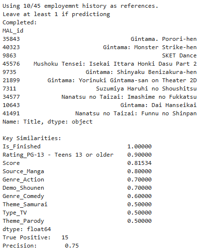
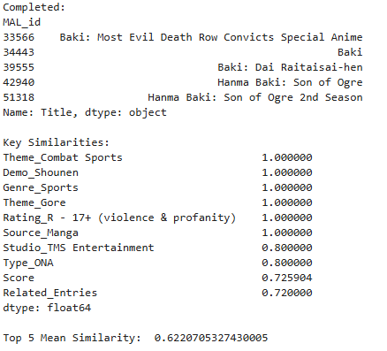

# DATA102 Anime Voice Actor Recommendation System
Creating and evaluating Actor Casting Recommender systems built using MBA and Matrix Filtering models with data from MyAnimeList forums.

## Discussion
[Presentation](https://www.canva.com/design/DAGj1FLaKhQ/V9bw78JF3CzYs5NgObxccg/edit?utm_content=DAGj1FLaKhQ&utm_campaign=designshare&utm_medium=link2&utm_source=sharebutton)

## Summary
Casting is a difficult process faced by those in the entertainment industry. Producers and Voice Actors have to engage in time consuming auditions without any guarantee of landing the role. 

This Recommender System studies different models (MBA and Matrix filtering) to help suggest Voice Actors best suited for specific roles.

### Market Basket Analysis with ARules
MBA analyzed the most frequent teams a crew member has worked in. The logic is that former coworkers share familiar work experiences and pipelines, hence they may better synergize. It's also the easieet to evaluate since Confidence shares the same formula as Precision ( X->Y or TP  / X or TP + FP ). The Z paramter controls how large the desired team size should be.

However it's very costly to run due to the amount of rules generated. It's also history based thus wouldn't be helpful for new hires. 

  
  <h3>MBA Recommendation Precision</h3>

### Collaborative Filtering
There's no guarantee that workers frequently collaborating are best matches, so how about base it of scoring instead? 

Collaborative filtering aims to suggest Voice Actors pairings/groupings where they were most liked by fans. User (actor) similarity in this case refers to fan favorite groupings whie dissimilar (negative) refers to actors that hurt each other's performance through being overshadowed.

  
  <h3>SVD (right) Strengthens Actor Similarity</h3>

### Content Based Filtering
Should an Actor lack sufficient history/projects to reference, Content Based Filtering can be used instead.

It will recommend based on the most common feature of the projects they've taken.

  
  <h3>Actor's Good Scoring in Shonnen Manga used in Recommendations</h3>
  
  <h3>Alternatively, identify a Studio/Series' Priority Themes</h3>

## Data Collection
The dataset is gathered from MyAnimeList (MAL), a popular anime database. Data is sourced from different pages, including seasonal anime lists and user watchlists. A web scraper was implemented to extract data from the forum's Anime and Actors pages. The seasonal anime lists and user watchlists were compiled using custom scripts, with the extracted information stored in CSV files. Regular expressions and automated scripts were used to parse and clean URLs, ensuring accurate extraction of anime IDs and related metadata. The collected data includes attributes such as anime titles, genres, themes, ratings, and user preferences.

Common Variables to Alter:
- Scraper.MINIMUM_DELAY # Delay per scrape to avoid being blocked
- YEAR : int
- SEASON : Scraper.SEASONS # enum

Files
- Notebooks:
  - Dev # Step by step Discussion
  - Automation # Full automated implementation
- Modules
  - Scraper.py
  - ScrapedPage.py

Packages used:
- BeautifulSoup4
- requests
- re
- pandas
- typing (Python 10+)
  

Outputs [.csv files]:
- Season/
- Detail/
- Statistics/Submissions/
- Statistics/Summary/

Targets:
- Season Page containing Anime Titles and Page Links
- Anime Details Page containing general info
- Anime Stats Page containing aggregated and individual viewership

## Exploratory Data Analysis (EDA)
Exploratory analysis was conducted to understand the dataset. Summary statistics were generated for numerical features such as ratings, number of members, and episode counts. Missing values in certain columns like 'Score' and 'Episodes' were identified, along with duplicate records from anime appearing across multiple seasons.

## Data Preprocessing
Preprocessing involved merging datasets from different sources, such as seasonal anime lists and user ratings. The data was formatted into structured tables with relevant fields. Columns such as 'MAL_id' were extracted from URLs, and categorical features like 'Genres' and 'Themes' were transformed for further processing.

### Data Cleaning
The dataset also undergoes data cleaning by removing duplicate records, handling missing values, and standardizing numerical features. Null values in 'Score' and 'Episodes' were imputed with zeros. Addtionally, the dataset was filtered to remove inconsistencies, ensuring a more accurate representation.

### Feature Engineering
Feature engineering involves transforming categorical and numerical features for model training. One-hot encoding was applied to categorical variables such as 'Genres', 'Themes', and 'Airing Status'. Numerical features like 'Score', 'Favorites', and 'Members' were scaled using MinMaxScaler to prevent dominance over categorical variables in similarity calculations. 

A Japanese nationality estimate was used based on Vowel composition in an actor's name. This helps separate Japanese and Gloabl VA datasets.

## Modeling
The recommendation system was implemented using two main approaches:
- Collaborative Filtering: User-item interaction data was used to compute similarity scores between users and items using cosine similarity.
- Content-Based Filtering: A similarity matrix was generated based on anime attributes, using both categorical and numerical features. Cosine similarity was applied to compare anime entries.

## Evaluation
The models were evaluated based on their ability to recommend relevant anime. Common evaluation metrics such as precision, recall, and mean average precision (MAP) were considered. Visualizations of similarity matrices and ranked recommendation lists were used to assess the effectiveness of the models.